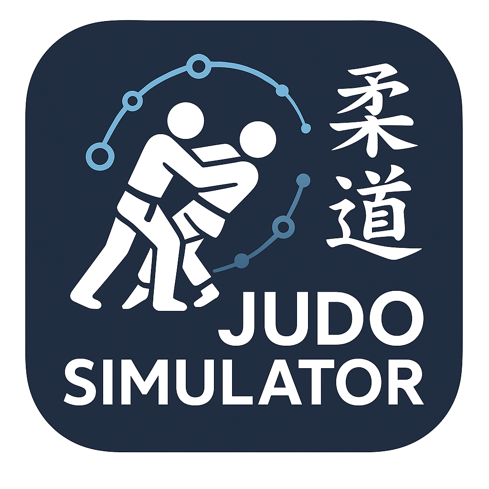
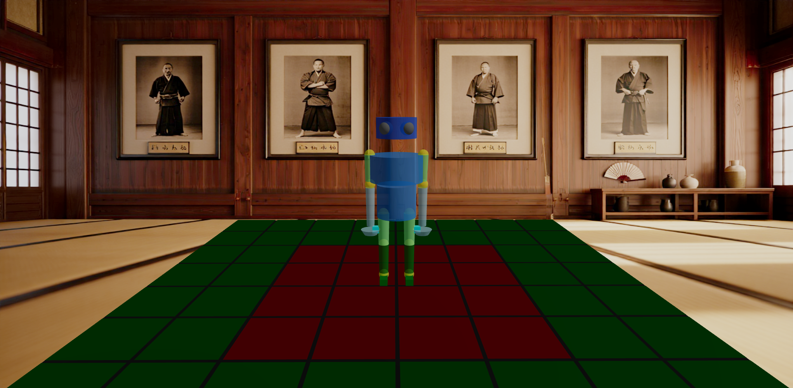

# Judo Interactive

A web-based 3D judo technique visualization tool.





## Features

### Pose Recording System
The application includes a real-time pose detection and recording system that allows users to:
- Capture poses using their webcam
- Record poses at configurable intervals
- Store and manage pose history
- Translate poses to 3D viewer positions

#### How Pose Recording Works
1. **Pose Detection**
   - Uses TensorFlow.js and MoveNet model for real-time pose detection
   - Detects 17 keypoints on the human body
   - Visualizes detected poses with keypoints and connections

2. **Pose Recording**
   - Records poses at user-defined intervals (default: 5 seconds)
   - Stores poses in two ways:
     - Local state for immediate display and interaction
     - Persistent storage for long-term access
   - Each recorded pose includes:
     - Timestamp
     - Keypoint positions
     - Confidence scores

3. **Pose Management**
   - View recorded poses in the "Recorded Positions" section
   - Select poses to view detailed information
   - Clear pose history when needed
   - Translate poses to 3D viewer positions

4. **Pose Translation**
   - Converts 2D pose keypoints to 3D limb rotations
   - Maps keypoint pairs to specific limbs
   - Calculates rotation angles for each limb
   - Applies rotations to the 3D model

## Installation

```bash
# Install dependencies
yarn install

# Start development server
yarn dev

# Run tests
yarn test

# Run tests in watch mode
yarn test:watch

# Run tests with coverage
yarn test:coverage

# Build for production
yarn build

# Preview production build
yarn preview
```

## Features

- 3D humanoid model with articulated joints
- Support for multiple judo techniques
- Toggle-based walking animation
- Keyboard shortcuts for technique selection
- Interactive technique cards with ON/OFF states
- Smooth animation transitions
- Error handling and recovery
- Position management system with save/load functionality
- Technique editor with visual flow-based programming
- Export/import capabilities for positions and techniques
- Screenshot functionality for capturing 3D scene states

## Components

### Scene
- 3D environment setup with proper lighting and camera controls
- Manages the humanoid model and animation state
- Position saving and loading system
- Default position reset functionality
- Screenshot capture system with automatic file naming
- Camera rotation controls with preset angles

### Humanoid
- Fully articulated 3D model with:
  - Head and body
  - Articulated arms (upper/lower) with hands
  - Articulated legs (upper/lower) with feet
  - Yellow joint indicators for better visualization
- Initial positioning ensures feet are properly aligned on the tatami mat
- Real-time position updates
- Smooth transitions between positions

### Animation System
- Keyframe-based animation system
- Support for:
  - Single-play techniques
  - Looping animations (like walking)
  - Toggle-based animations
  - Default stopped state
  - Position-based animations
- Smooth interpolation between keyframes
- Error recovery and state management

### Technique Editor
- Visual flow-based programming interface
- Node-based movement creation
- Real-time technique preview
- Save and load technique configurations
- Export/import technique definitions
- Last updated timestamps for techniques
- Technique categorization and filtering
- Automatic state persistence

### Position Management
- Save current model positions
- Load saved positions
- Export positions as JSON
- Position cards with timestamps
- Default position reset
- Smooth transitions between positions
- Screenshot preview in position cards

### UI Components
- Technique cards showing:
  - Name in English
  - Japanese name
  - Category
  - Difficulty level
  - Last updated timestamp
- Position cards with:
  - Position name
  - Timestamp
  - Preview indicator
- Export/import buttons for data management
- Screenshot capture button
- Camera control buttons

## Usage

### Keyboard Shortcuts
- `1`: First technique
- `2`: Second technique

### Mouse/Touch
- Click technique cards to execute techniques
- Toggle walking animation ON/OFF
- Use OrbitControls to rotate and zoom the view
- Click position cards to load saved positions
- Click export button to save positions/techniques
- Click screenshot button to capture current view

### Camera Controls
- Rotate X/Y/Z axis by 45° increments
- Reset camera to default position
- Zoom in/out with scroll wheel
- Orbit with left mouse button
- Pan with right mouse button

### Position Management
- Save positions with screenshots
- Export all positions as JSON
- Import positions from JSON files
- Reset to default position
- Quick position switching

### Technique Editor
- Create new techniques
- Add movement nodes
- Connect nodes to create sequences
- Edit node parameters
- Save and load techniques
- Export techniques as JSON
- Delete unwanted techniques

## Technical Implementation

### Key Technologies
- React
- TypeScript
- Three.js
- React Three Fiber
- React Three Drei
- React Flow (for technique editor)

### Animation Architecture
- Uses React's `useFrame` for animation updates
- Implements keyframe interpolation
- Handles animation state management
- Provides error recovery mechanisms
- Smooth transitions between states

## Development

```bash
# Run linter
yarn lint

# Type checking
yarn tsc
```

## Testing
The project uses Jest and React Testing Library for testing. Tests are located next to their corresponding components with the `.test.ts` or `.test.tsx` extension.

```bash
# Run all tests
yarn test

# Run tests in watch mode
yarn test:watch

# Run tests with coverage report
yarn test:coverage
```

## Future Enhancements
Potential areas for future development:
- Additional judo techniques
- More complex animations
- Physics-based interactions
- Performance optimizations
- Mobile responsiveness improvements
- Advanced technique editor features
- Enhanced position management
- Multi-model interactions

# GoKyo

# https://en.wikipedia.org/wiki/List_of_Kodokan_judo_techniques
